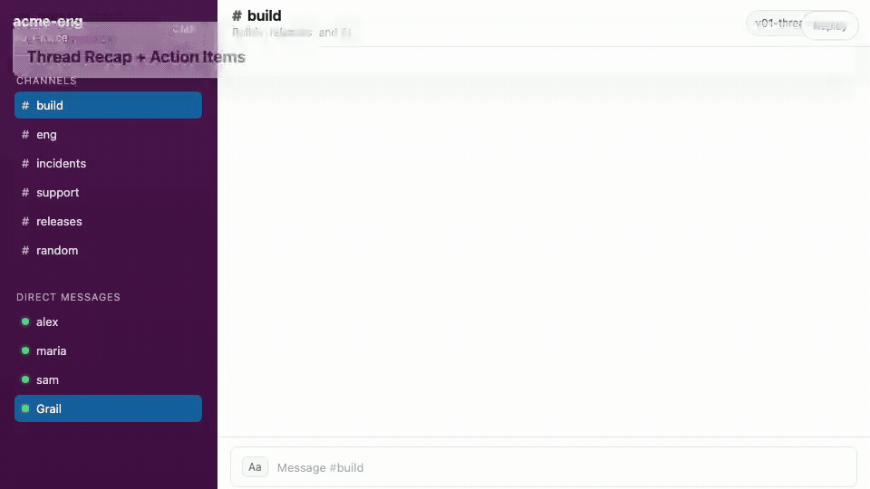

# Grail - Your MicroEmployee

Grail is a single-tenant “micro employee” you deploy as a service and connect to Slack and/or Telegram.

In Slack, you can mention it:

`@Grail do so and so`

In Telegram (DM or group), you can address it via `/microemployee ...` (or @mention in groups).

## Demo


Re-record the assets: see the `MicroEmployee-Demo-Video` repo.

## These Are The Things Grail Can Do

1. Recap long threads into action items (and attach a markdown report).
   - 
2. Coordinate incident response: summarize state, owners, next steps.
   - 
3. Review PRs and call out risk areas with concrete suggestions.
   - 
4. Triage support requests and propose the next best actions.
   - 
5. Safely run operational commands with guardrails and in-Slack approvals.
   - 

Grail will:

- Acknowledge quickly (queues a job).
- Inject the last **N** recent messages as context (configurable).
- Work through tasks **one-at-a-time** from a SQLite-backed queue.
- Reply back in the originating thread/chat.
- Optionally use Slack MCP tools to fetch more context beyond the last N messages.
- Optionally use Web MCP tools (Brave search + fetch).
- Persist durable notes under `/data/context/` and a rolling session memory summary.
- Enforce local guardrails for risky actions and request human approval in-chat when needed.

This repo is Rust-first (server + Slack MCP server), and uses the open-source Codex CLI app-server for the agent runtime.

Note: the `Dockerfile` downloads a pinned Codex release (`CODEX_VERSION` build arg). Update that version periodically if you want newer Codex behavior.

## Deploy On Railway (Recommended)

1. Create a new Railway project from this repo.
2. Add a **Volume** mounted at `/data` (required for persistence).
   - Keep replicas at **1**. This template uses SQLite on the mounted volume and is intended to run single-replica.
3. Set environment variables:
   - `ADMIN_PASSWORD` (required)
   - Slack (optional):
     - `SLACK_SIGNING_SECRET` (required if using Slack; can also be stored in SQLite if `GRAIL_MASTER_KEY` is set)
     - `SLACK_BOT_TOKEN` (required if using Slack; can also be stored in SQLite if `GRAIL_MASTER_KEY` is set)
   - Telegram (optional):
     - `TELEGRAM_BOT_TOKEN` (required if using Telegram; can also be stored in SQLite if `GRAIL_MASTER_KEY` is set)
     - `TELEGRAM_WEBHOOK_SECRET` (required if using Telegram; can also be stored in SQLite if `GRAIL_MASTER_KEY` is set)
   - `OPENAI_API_KEY` (recommended)
   - `GRAIL_MASTER_KEY` (optional; required only if you want to store secrets (OpenAI/Slack) via the dashboard, encrypted in SQLite). Generate with: `openssl rand -hex 32`
   - `BASE_URL` (optional; used only to render full URLs in the dashboard, e.g. the Slack events URL)
4. Deploy.

After deploy:

- Slack events endpoint is `POST /slack/events`
- Slack interactive endpoint is `POST /slack/actions` (optional, for approval buttons)
- Telegram webhook endpoint is `POST /telegram/webhook`
- Dashboard is `GET /admin` (Basic Auth: `admin:<ADMIN_PASSWORD>`)

## Slack App Setup (Bring Your Own App)

This template is intentionally “single workspace per deployment”.

1. Create a Slack App in your workspace.
2. Use the provided manifest: `slack-app-manifest.yaml`
3. Set the request URL in the manifest to:
   - `https://<your-railway-domain>/slack/events`
4. (Optional) If you want clickable approval buttons, set interactivity request URL:
   - `https://<your-railway-domain>/slack/actions`
5. Install the app to your workspace.
6. Copy:
   - **Signing Secret** -> `SLACK_SIGNING_SECRET` (or store it in `/admin/settings` if `GRAIL_MASTER_KEY` is set)
   - **Bot User OAuth Token** -> `SLACK_BOT_TOKEN` (or store it in `/admin/settings` if `GRAIL_MASTER_KEY` is set)

## Telegram Setup (Bring Your Own Bot)

1. Create a bot with `@BotFather`, copy the token.
2. Set `TELEGRAM_BOT_TOKEN` (env var or `/admin/settings` if `GRAIL_MASTER_KEY` is set).
3. In `/admin/settings`, enable Telegram.
4. Set the Telegram webhook:

```bash
curl -sS "https://api.telegram.org/bot${TELEGRAM_BOT_TOKEN}/setWebhook" \
  -d "url=https://<your-service-domain>/telegram/webhook" \
  -d "secret_token=${TELEGRAM_WEBHOOK_SECRET}"
```

Telegram history note: the Bot API can’t fetch arbitrary chat history, so Grail injects Telegram context from messages it has previously received (stored in SQLite).

## Dashboard

`/admin/settings` lets you configure:

- Slack context size (last N messages)
- model + reasoning knobs
- permissions mode (`read` vs `full`)
- command approval mode + guardrails behavior
- Slack user allow list + channel allow list
- Slack MCP tool enable/disable
- web MCP tool enable/disable
- context writes enable/disable
- shell network access toggle (full mode only)
- Telegram enable + allow list

If `GRAIL_MASTER_KEY` is set, you can also store `OPENAI_API_KEY`, `SLACK_SIGNING_SECRET`, and `SLACK_BOT_TOKEN` encrypted in SQLite from the dashboard.
Telegram secrets can also be stored the same way.

`/admin/auth` lets you optionally log in with ChatGPT via a device code flow (writes tokens to `/data/codex/auth.json`). This is useful if you don't want to provide an API key.

`/admin/tasks` shows the queue, and lets you cancel queued tasks and retry failed tasks.

`/admin/approvals` shows pending approvals (commands, cron proposals, guardrail proposals).

`/admin/guardrails` lets you edit command guardrails (allow/require_approval/deny).

`/admin/memory` shows per-conversation rolling memory summaries (and lets you reset them).

`/admin/context` lets you view/edit `/data/context` files (including `AGENTS.md` and `INDEX.md`).

## Persistence Layout

Mount a volume at `/data`.

Grail stores:

- `/data/grail.sqlite` (queue, settings, session mapping)
- `/data/context/` (durable notes)
- `/data/context/AGENTS.md` (default instruction “constitution” for the agent)
- `/data/codex/` (`CODEX_HOME` for Codex app-server rollouts/state)

## Permissions Model

- `read`: no command execution; no context writes.
- `full`: command execution is allowed (with sandboxing); context writes allowed (restricted to `/data/context`).

Even in `read`, Grail can respond and (optionally) use Slack MCP tools to fetch more Slack context.

## Local Development

You’ll need:

- Rust toolchain
- `codex` on your PATH (or set `CODEX_BIN`)
- Slack + OpenAI credentials

Run:

```bash
cd grail
export ADMIN_PASSWORD=dev
export SLACK_SIGNING_SECRET=...
export SLACK_BOT_TOKEN=...
export OPENAI_API_KEY=...
cargo run -p grail-server
```

## Custom Development

Need a tailored agent setup, custom integrations, or help deploying MicroEmployee for your team? We build custom AI infrastructure.

Reach out: **yash@grail.computer**
